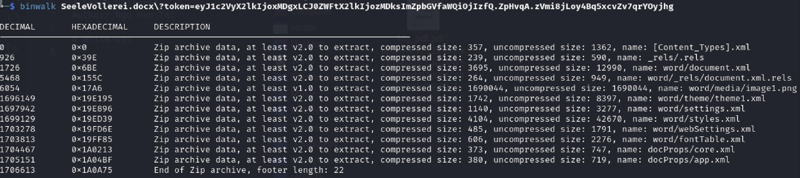
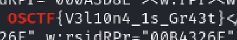

# Seele Vellorei
Author: Ngo Van Tai

# Write-ups
The problem gives us a file docx (Microsoft Word 2007+). I tried to use `binwalk` on it

We can see that there're a lot of zip file, I may want to extract all of them 
We can use `binwalk -e` to extract it

Then we recieve a big folder containing a lot of files and sub-folders, the flag may be in one of these folders. I used `grep` through all the files

Command to find the keyword in the big folder

