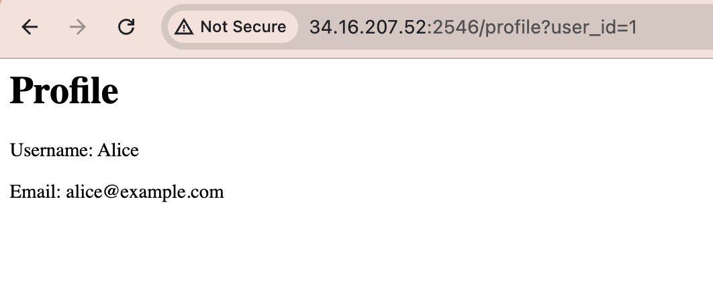
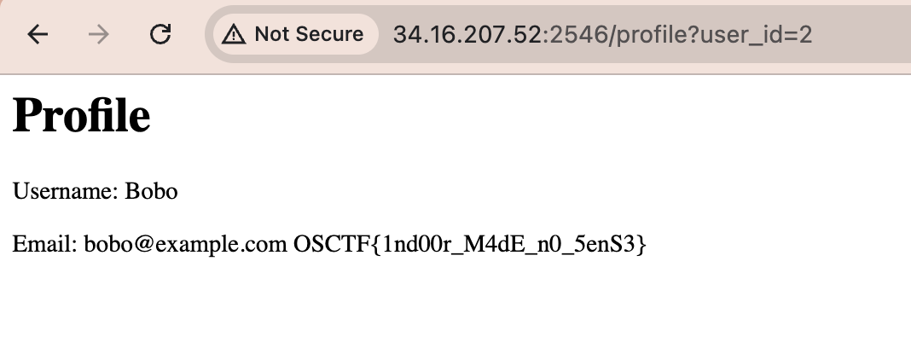

# Indoor WebApp

## Description

```
The production of this application has been completely indoor so that no corona virus spreads, but that's an old talk right?
Author: @5h1kh4r

Web Instance: http://34.16.207.52:2546
```

## Write-up

From the main page, click on _View Profile_ and forward to Profile page


In the URL, there's a parameter with its corresponding value **user_id=1**

Try using other values for that param, starting with **user_id=2**

Then we'll get the flag

